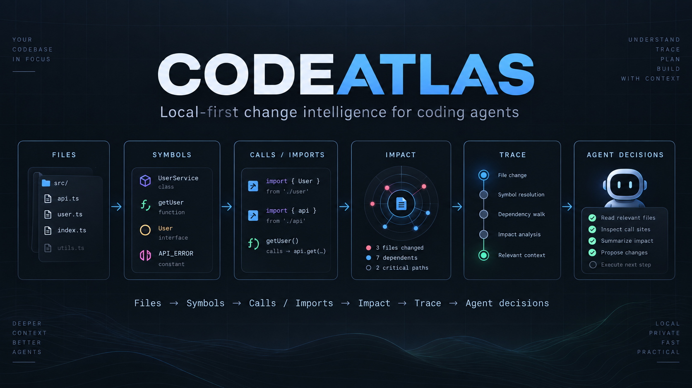
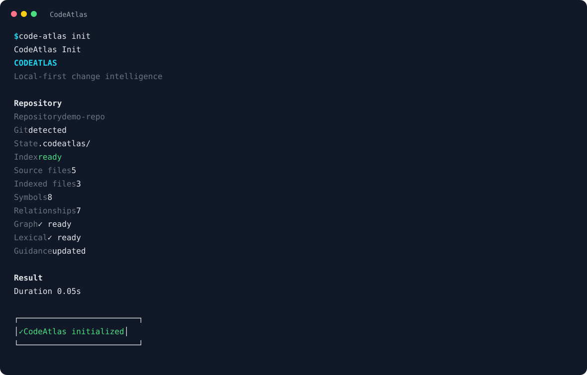
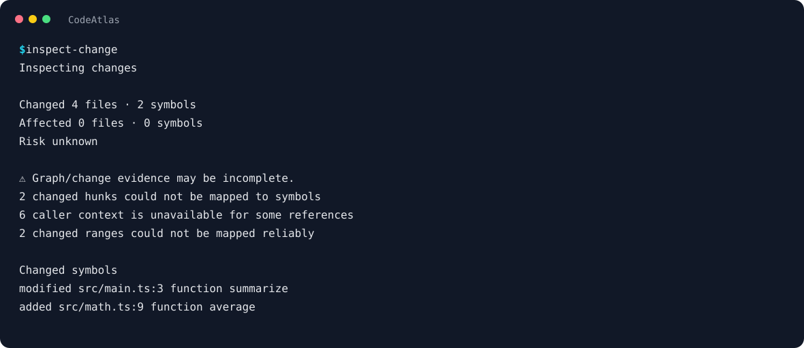
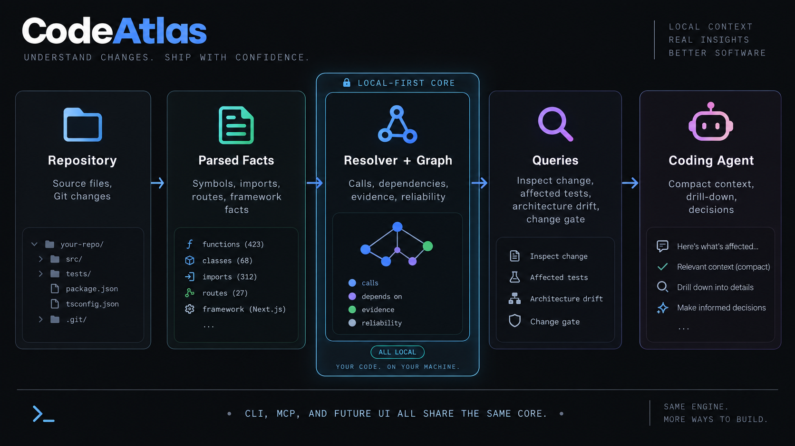
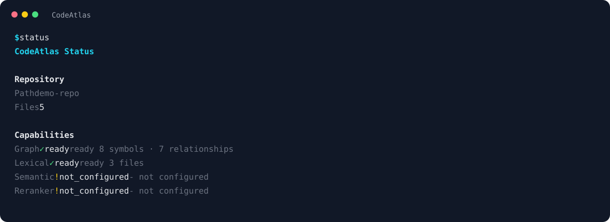
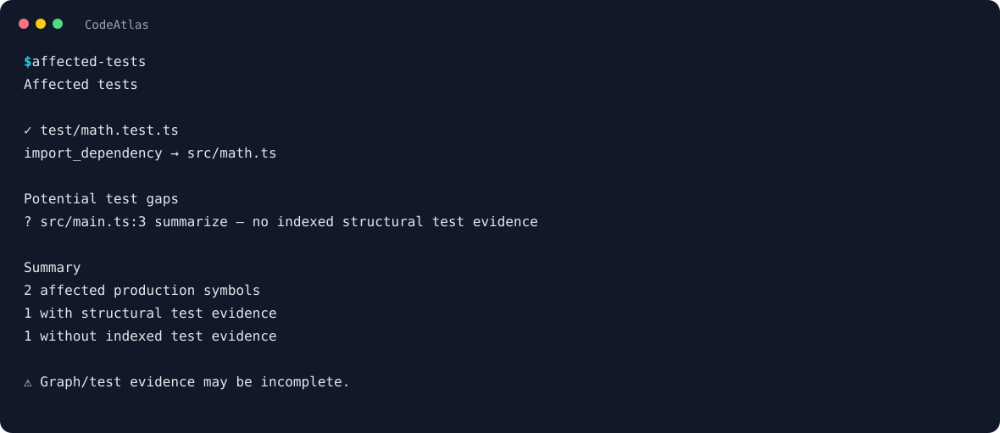

# CodeAtlas

CodeAtlas gives coding agents structured intelligence about a repository: symbols,
calls, imports, execution paths, and change impact. It runs locally, builds a
lightweight graph and lexical index, and exposes the result through MCP and the
CLI.

<p align="center">
  
</p>

Understand structure and blast radius before making a change—without requiring a
model download.

[](https://www.npmjs.com/package/@showdar2112/code-atlas)
[](https://nodejs.org/)
[](https://modelcontextprotocol.io/)

## Quick start

```bash
npm install -g @showdar2112/code-atlas

cd my-project
code-atlas init
code-atlas connect
```

`init` creates the local `.codeatlas/` state, scans the repository, builds the
graph and lexical indexes, and refreshes the managed `AGENTS.md` guidance block.
`connect` detects supported coding-agent installations and opens a selector in
an interactive terminal.



The normal onboarding path needs no model runtime. To bootstrap without indexing
and build the indexes later, use the advanced opt-out:

```bash
code-atlas init --no-index
code-atlas index
```

The selector is illustrative—an agent appears enabled only when CodeAtlas can
detect it in the current environment:

```text
Connect CodeAtlas

Select integrations:

❯ ◯ Codex
  ◯ OpenCode
  ◯ Claude Code
  ◯ Gemini CLI
  ◯ Cursor
  ◯ Cline
  ◯ Windsurf
  ◯ Zoo Code

Space toggle · A select all detected · Enter confirm · Esc cancel
```

For scripts and CI, use an explicit integration or `--all`:

```bash
code-atlas connect codex
code-atlas connect --all
code-atlas disconnect codex
code-atlas disconnect --all
```

## Task context compiler

CodeAtlas separates context selection from context delivery. The current stack
works as follows:

- **Context-aware delivery (Phase15A):** decides how much source/context to
  deliver for an explicit file or symbol request. `context_read` remains the
  explicit delivery surface.
- **Task context compilation (Phase15B):** decides which files and symbols are
  worth reading. It produces a bounded, deterministic, evidence-backed plan;
  it does not return source bodies directly.
- **Durable task context (Phase15C):** gives a task context an explicit
  `taskContextId` and durable start, refresh, and close lifecycle. The
  lifecycle keeps its session and context-generation identities and reports
  delivery metrics such as full, unchanged, delta, and rehydrated results when
  those modes apply.

Compile a bounded task-context plan with the CLI:

```bash
code-atlas context-compile --task "Fix repository status handling"
code-atlas context-compile --task "Fix repository status handling" --json
```

The same capability is available through the MCP `compile_task_context` tool.
The durable lifecycle is available through the CLI commands
`context-start`, `context-refresh`, and `context-close`, and through the MCP
tools `start_task_context`, `refresh_task_context`, and `close_task_context`.
The compiled plan returns file/symbol references and evidence metadata, not
source bodies; `context_read` remains the explicit delivery step.

## Internal context evaluation gate

Phase15D is an internal contributor and release-verification gate for the
Phase15A/B/C context behavior. It is not a new runtime intelligence feature
and is not a public `code-atlas eval` command.

Run the deterministic, offline evaluator with:

```bash
pnpm run eval:context
```

It uses reviewed synthetic fixtures covering the 12 production languages in
the language registry and frozen real-world snapshots. The gate checks
selection and delivery correctness, exact reconstruction, deterministic
selection/ranking, authority and explicit incomplete-evidence diagnostics,
durable lifecycle behavior, and reviewed quality-regression policy. It emits
human-readable output and a machine-readable report under the transient
`artifacts/` directory. It uses no LLM judge, network access, or runtime
corpus download.

Correctness and determinism failures are hard failures. Incomplete evidence
must remain explicit rather than being treated as authoritative negative
evidence. Versioned golden baselines provide catastrophic per-case regression
protection and aggregate quality limits; performance observations are
non-blocking and are not semantic equality criteria.

Synthetic fixtures provide controlled cross-language coverage. Frozen snapshots
provide realistic repository cases with tracked provenance and license-notice
metadata. The evaluator protects corpus truth from accidental mutation; these
snapshots are evaluation inputs, not third-party source shipped as runtime
content.

## Why CodeAtlas

### Understand before editing

Find symbols, callers, callees, dependencies, and bounded execution paths before
changing unfamiliar code.

### Know the blast radius

Impact analysis follows structural dependencies so shared changes can be checked
before they spread through a repository.

### Built for coding agents

Use MCP, generated repository guidance, direct CLI workflows, and automatic
configuration for supported coding agents.

### Local-first and lightweight

The useful default is graph intelligence plus lexical search. CodeAtlas does not
require model downloads, Transformers, a local LLM, Python, Docker, a GPU, or a
remote indexing service.

### Honest confidence

Incomplete graph evidence is surfaced explicitly. CodeAtlas does not turn an
uncertain negative result into a confident claim.

## Change intelligence

`inspect-change` maps the current Git diff to changed and affected symbols. The
result reports risk and evidence quality, so incomplete graph coverage remains
visible instead of becoming a confident guess. Use `impact` for a focused
dependency walk and `affected-tests` to find structural test evidence and gaps.



## Core capabilities

| Capability | What it gives an agent |
| --- | --- |
| Code search | Fast lexical search across indexed source and symbols |
| Symbol lookup | Definitions, locations, types, and qualified names |
| Call graph | Callers and callees for a resolved symbol |
| Import graph | Imports and reverse-import relationships |
| Impact analysis | Direct and transitive affected symbols |
| Trace | Bounded paths through repository relationships |
| Incremental sync | Refresh changed, added, and deleted files |
| Repository status | Readiness, freshness, counts, and recovery hints |
| Git hooks | Optional post-commit and post-checkout refresh |
| MCP | The same local intelligence for coding-agent workflows |

## Agent integrations

CodeAtlas currently supports eight first-class integrations:

`Codex` · `OpenCode` · `Claude Code` · `Gemini CLI` · `Cursor` · `Cline` · `Windsurf` · `Zoo Code`

| Integration | Connect |
| --- | --- |
| Codex | `code-atlas connect codex` |
| OpenCode | `code-atlas connect opencode` |
| Claude Code | `code-atlas connect claude` |
| Gemini CLI | `code-atlas connect gemini` |
| Cursor | `code-atlas connect cursor` |
| Cline | `code-atlas connect cline` |
| Windsurf | `code-atlas connect windsurf` |
| Zoo Code | `code-atlas connect zoo` |

Use the registry-driven selector for a terminal workflow:

```bash
code-atlas connect
code-atlas disconnect
```

Use deterministic bulk operations in automation:

```bash
code-atlas connect --all
code-atlas disconnect --all
```

`connect --all` operates on detected and safely configurable integrations.
`disconnect --all` removes recognizable CodeAtlas-managed configuration while
preserving unrelated client settings.

For compatibility with older scripts, these aliases remain available:

```bash
code-atlas integration install codex
code-atlas integration uninstall codex
code-atlas integration list
code-atlas integration status
```

## MCP for any client

First-class adapters are convenient, but they are not required. To obtain the
durable CodeAtlas stdio launch configuration for another MCP client:

```bash
code-atlas integration config --format json
```

The command prints only this JSON shape and does not modify third-party files:

```json
{
  "command": "/absolute/path/to/node",
  "args": [
    "/absolute/path/to/code-atlas/dist/cli.js",
    "mcp"
  ]
}
```

The exported launcher uses absolute paths and does not depend on an interactive
shell PATH. It can be pasted into any compatible stdio MCP client.

## MCP tools

Start CodeAtlas as an MCP server with `code-atlas mcp`, or let a configured agent
start the persisted stdio launcher.

| Task | Tool | When to use |
| --- | --- | --- |
| Check repository state | `repository_status` | Before relying on indexed evidence |
| Build indexes | `index_repository` | First index or deliberate rebuild |
| Refresh changes | `sync_repository` | After source changes |
| Search code | `search_code` | Find relevant files, symbols, or text |
| Inspect a symbol | `get_symbol` | Read a symbol and its source context |
| Find callers | `find_callers` | Assess who depends on a symbol |
| Find callees | `find_callees` | Follow what a symbol invokes |
| Find imports | `find_imports` | Inspect module dependencies |
| Find reverse imports | `find_imported_by` | Find modules depending on a file |
| Assess impact | `impact` | Estimate direct and transitive blast radius |
| Inspect changes | `inspect_change` | Map Git changes to changed symbols and structural impact |
| Find affected tests | `affected_tests` | Select structural test evidence and identify test gaps |
| Explain incomplete evidence | `explain_incomplete` | Explain coverage gaps and direct-verification targets |
| Compare structural changes | `graph_delta` | Compare structural relationships before and after Git changes |
| Detect architecture drift | `architecture_drift` | Detect introduced/resolved policy violations and import cycles |
| Evaluate change policy | `change_gate` | Evaluate a Git change against deterministic repository policy |
| Trace a path | `trace` | Follow a bounded relationship path |
| Inspect retrieval | `inspect_retrieval` | Understand search and context stages |

MCP `tools/list` publishes a description and input schema for each tool. The
descriptions guide tool choice: use `search_code` for matching-code lookup,
`get_symbol` when the symbol is known, `compile_task_context` to assemble bounded
task evidence, and `context_read` to deliver a selected file. Schemas
include field guidance and constraints. Each tool also publishes the standard
`readOnlyHint`, `destructiveHint`, `idempotentHint`, and `openWorldHint`
annotations. These are hints for MCP clients, not access controls. Current tool
handlers work with local repositories and state and make no network calls.

## Trustworthy evidence

Graph readiness is not the same as graph completeness.

`mayBeIncomplete=true` means the available graph evidence does not cover a query
confidently enough for an authoritative negative conclusion. `risk=unknown` means
CodeAtlas cannot safely classify a change from that incomplete evidence.

In particular:

```text
No callers found + mayBeIncomplete=true ≠ no callers exist
```

CodeAtlas does not infer architecture from folders. With an optional tracked
`codeatlas.config.json`, `architecture_drift` compares baseline and target
relationships, reports newly introduced or resolved dependency-policy violations,
and detects newly introduced import cycles even without policy configuration. The
analysis versions the policy with the Git source being inspected, so findings can
be attributed to `code_change`, `policy_change`, or `both`; formatting and
presentation-only policy edits do not create drift.

<details>
<summary>Architecture policy example</summary>

```json
{
  "version": 1,
  "architecture": {
    "groups": [
      { "id": "ui", "include": ["src/ui/**"] },
      { "id": "domain", "include": ["src/domain/**"] },
      { "id": "data", "include": ["src/data/**"] }
    ],
    "defaultCrossGroupAction": "allow",
    "rules": [
      {
        "id": "ui-no-data",
        "from": "ui",
        "to": "data",
        "action": "deny",
        "edgeKinds": ["imports", "calls"],
        "severity": "high"
      }
    ],
    "cycles": { "enabled": true, "severity": "medium" }
  }
}
```

Groups use repository-relative include/exclude globs. Ambiguous membership is
reported as incomplete evidence rather than resolved by rule order.
</details>

An optional `gate` section turns the same structured evidence into deterministic
CI policy. Gate policy is always read from the repository-root `codeatlas.config.json`
so a change cannot select another policy file to bypass the committed Gate. For example:
`{ "gate": { "risk": { "maxAllowed": "medium" } } }`.
Gate evaluates the trusted baseline policy first; a newly added policy is checked
as a target bootstrap, so a change cannot weaken its own enforcement.

When coverage is incomplete, agents are guided to verify important negative
findings directly in the source. This keeps CodeAtlas useful without pretending
that a partial index is complete.

For test intelligence, “no indexed structural test evidence” means no indexed
relationship was found; it does not prove that no test exists.

## Agent reporting

Generated `AGENTS.md` guidance teaches supported coding agents to report material
CodeAtlas findings, limitations, and fallbacks concisely.

Successful analysis might be summarized as:

```text
CodeAtlas impact analysis identified 5 affected symbols across 3 files.
```

When the index is unavailable:

```text
CodeAtlas impact analysis was unavailable because the repository was not indexed;
direct source inspection was used instead.
```

Trivial tasks do not need CodeAtlas boilerplate.

## How it works

Repository → Parsed Facts → Resolver + Graph → Queries → Coding Agent



The graph and lexical indexes are shared core services. CLI, MCP, UI, and agent
integration workflows consume those services rather than maintaining separate
analysis paths.

## Repository status / reliability

`status` shows the repository path, indexed counts, capability readiness, and
optional services that are not configured. It is the quickest way to check
whether a result is ready to trust before asking for deeper analysis.



## Affected tests

`affected-tests` uses indexed structural evidence to identify tests connected to
changed production symbols. It also calls out potential test gaps when the
available graph evidence is incomplete.



## CLI reference

Run `code-atlas --help` for the live command surface.

| Area | Commands |
| --- | --- |
| Repository | `init`, `index`, `sync`, `status` |
| Change intelligence | `inspect-change` |
| Test intelligence | `affected-tests` |
| Structural graph delta | `graph-delta` |
| Coverage diagnostics | `explain-incomplete` |
| Architecture drift | `architecture-drift` |
| Change Gate | `gate` |
| Integrations | `connect`, `disconnect`, `integrations`, `integration ...` |
| Hooks | `hook install`, `hook uninstall`, `hook status` |
| Runtime | `mcp`, `serve` |
| Updates | `upgrade` |

## CLI self-upgrade

Updates are opt-in. Ordinary commands do not check the registry.
`code-atlas upgrade --check` performs a read-only version check; add `--json` for
stable fields: `currentVersion`, `latestVersion`, `updateAvailable`, `manager`,
`upgraded`, and `verifiedVersion`. `manager` is `null` when no unique supported
global install is found. `code-atlas upgrade` installs an available update, and
successful `code-atlas upgrade --json` runs return the same fields.

Automatic updates are supported only for an unambiguous global npm or pnpm
installation on POSIX. CodeAtlas installs the exact registry version and runs the
installed CLI to verify it. Local, linked, Homebrew, wrapper-based, or ambiguous
installations fail closed without an automatic install. On Windows, both
automatic updates and registry checks fail closed without invoking package
manager shims; `upgrade --check` directs contributors to run
`npm view @showdar2112/code-atlas@latest version` manually. On POSIX, check-only
mode can use the npm registry when the active installation source is unsupported.

Common workflows:

```bash
# Initialize and index a repository
code-atlas init

# Refresh changed files
code-atlas sync

# Rebuild the full graph and lexical indexes
code-atlas index

# Inspect readiness and freshness
code-atlas status

# Start the MCP server over stdio
code-atlas mcp

# Start the HTTP adapter for a repository
code-atlas serve [path]
```

## Repository lifecycle

```text
First time       code-atlas init
After changes    code-atlas sync
Full rebuild     code-atlas index
Check readiness  code-atlas status
```

Optional Git hooks can keep the local state refreshed after commits and
checkouts:

```bash
code-atlas hook install --post-commit --post-checkout
```

## Local-first by default

CodeAtlas requires Node.js 22 or newer and its regular Node package dependencies.
It does not require:

- model downloads
- Transformers or an ONNX semantic runtime
- a local LLM
- Python
- Docker
- a GPU
- a remote indexing service

Semantic providers remain optional. The default experience is useful with graph,
lexical, and change/impact intelligence alone.

## Development

```bash
pnpm install
pnpm build
pnpm test
pnpm lint
pnpm run ui:typecheck
pnpm run eval:context
```

Focused Phase15E checks:

```bash
node --import tsx/esm --test \
  test/phase15e-mcp-metadata.test.ts \
  test/phase15e-upgrade-check.test.ts \
  test/phase15e-upgrade-install.test.ts
pnpm run test:mcp:inspector
```

The Inspector check launches the actual stdio server and verifies protocol
initialization, `tools/list`, and tool calls. MCP Inspector is pinned to 2.7.0.
Its verifier skips on Node versions below 22.19; CodeAtlas itself still supports
Node.js 22 and newer. The full contributor test suite is `pnpm test` above.

The evaluation baseline is updated only as an explicit reviewed maintenance
operation, after correctness and determinism are verified:

```bash
pnpm run eval:context:update-baseline -- --write
```

The normal `pnpm run eval:context` command never writes the golden baseline.

The npm package is `@showdar2112/code-atlas`; it installs the `code-atlas`
command. The package can also be installed globally with pnpm:

```bash
pnpm add -g @showdar2112/code-atlas
```

## Roadmap

Deferred work includes:

- VS Code / GitHub Copilot integration
- richer visual exploration
- further change-intelligence workflows
- optional semantic-provider integrations

These are independent of the lightweight graph and lexical core.

## License

ISC. See `package.json` for the package metadata.
