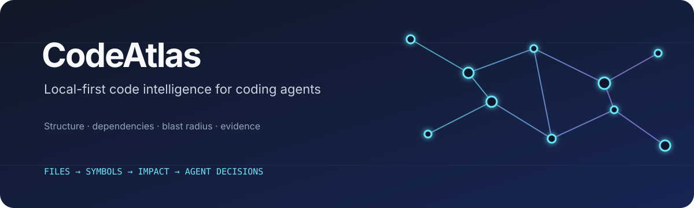
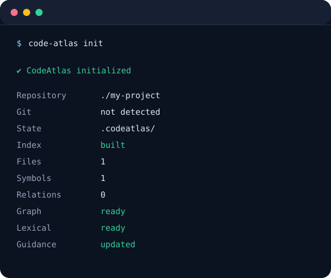
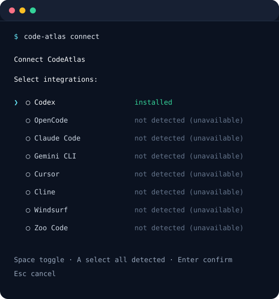
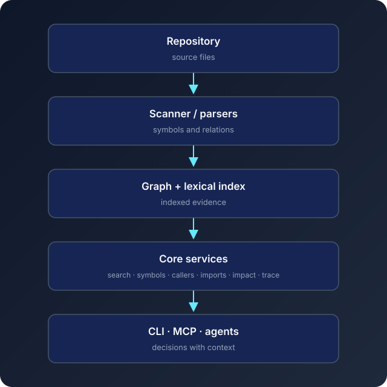

# CodeAtlas

CodeAtlas gives coding agents structured intelligence about a repository: symbols,
calls, imports, execution paths, and change impact. It runs locally, builds a
lightweight graph and lexical index, and exposes the result through MCP and the
CLI.

Understand structure and blast radius before making a change—without requiring a
model download.

[](https://www.npmjs.com/package/code-atlas)
[](https://nodejs.org/)
[](https://modelcontextprotocol.io/)



## Quick start

```bash
npm install -g code-atlas

cd my-project
code-atlas init
code-atlas connect
```

`init` creates the local `.codeatlas/` state, scans the repository, builds the
graph and lexical indexes, and refreshes the managed `AGENTS.md` guidance block.
`connect` detects supported coding-agent installations and opens a selector in
an interactive terminal.

The normal onboarding path needs no model runtime. To bootstrap without indexing
and build the indexes later, use the advanced opt-out:

```bash
code-atlas init --no-index
code-atlas index
```

The selector is illustrative—an agent appears enabled only when CodeAtlas can
detect it in the current environment:

```text
Connect CodeAtlas

Select integrations:

❯ ◯ Codex
  ◯ OpenCode
  ◯ Claude Code
  ◯ Gemini CLI
  ◯ Cursor
  ◯ Cline
  ◯ Windsurf
  ◯ Zoo Code

Space toggle · A select all detected · Enter confirm · Esc cancel
```

For scripts and CI, use an explicit integration or `--all`:

```bash
code-atlas connect codex
code-atlas connect --all
code-atlas disconnect codex
code-atlas disconnect --all
```

## Why CodeAtlas

### Understand before editing

Find symbols, callers, callees, dependencies, and bounded execution paths before
changing unfamiliar code.

### Know the blast radius

Impact analysis follows structural dependencies so shared changes can be checked
before they spread through a repository.

### Built for coding agents

Use MCP, generated repository guidance, direct CLI workflows, and automatic
configuration for supported coding agents.

### Local-first and lightweight

The useful default is graph intelligence plus lexical search. CodeAtlas does not
require model downloads, Transformers, a local LLM, Python, Docker, a GPU, or a
remote indexing service.

### Honest confidence

Incomplete graph evidence is surfaced explicitly. CodeAtlas does not turn an
uncertain negative result into a confident claim.

## Terminal proof

These captures come from the current CLI in isolated temporary environments;
machine-specific paths are normalized for documentation. Detection-dependent
integration rows are shown exactly as observed in the capture.

### Initialize and index



### Select a detected integration



## Core capabilities

| Capability | What it gives an agent |
| --- | --- |
| Code search | Fast lexical search across indexed source and symbols |
| Symbol lookup | Definitions, locations, types, and qualified names |
| Call graph | Callers and callees for a resolved symbol |
| Import graph | Imports and reverse-import relationships |
| Impact analysis | Direct and transitive affected symbols |
| Trace | Bounded paths through repository relationships |
| Incremental sync | Refresh changed, added, and deleted files |
| Repository status | Readiness, freshness, counts, and recovery hints |
| Git hooks | Optional post-commit and post-checkout refresh |
| MCP | The same local intelligence for coding-agent workflows |

## Agent integrations

CodeAtlas currently supports eight first-class integrations:

`Codex` · `OpenCode` · `Claude Code` · `Gemini CLI` · `Cursor` · `Cline` · `Windsurf` · `Zoo Code`

| Integration | Connect |
| --- | --- |
| Codex | `code-atlas connect codex` |
| OpenCode | `code-atlas connect opencode` |
| Claude Code | `code-atlas connect claude` |
| Gemini CLI | `code-atlas connect gemini` |
| Cursor | `code-atlas connect cursor` |
| Cline | `code-atlas connect cline` |
| Windsurf | `code-atlas connect windsurf` |
| Zoo Code | `code-atlas connect zoo` |

Use the registry-driven selector for a terminal workflow:

```bash
code-atlas connect
code-atlas disconnect
```

Use deterministic bulk operations in automation:

```bash
code-atlas connect --all
code-atlas disconnect --all
```

`connect --all` operates on detected and safely configurable integrations.
`disconnect --all` removes recognizable CodeAtlas-managed configuration while
preserving unrelated client settings.

For compatibility with older scripts, these aliases remain available:

```bash
code-atlas integration install codex
code-atlas integration uninstall codex
code-atlas integration list
code-atlas integration status
```

## MCP for any client

First-class adapters are convenient, but they are not required. To obtain the
durable CodeAtlas stdio launch configuration for another MCP client:

```bash
code-atlas integration config --format json
```

The command prints only this JSON shape and does not modify third-party files:

```json
{
  "command": "/absolute/path/to/node",
  "args": [
    "/absolute/path/to/code-atlas/dist/cli.js",
    "mcp"
  ]
}
```

The exported launcher uses absolute paths and does not depend on an interactive
shell PATH. It can be pasted into any compatible stdio MCP client.

## MCP tools

Start CodeAtlas as an MCP server with `code-atlas mcp`, or let a configured agent
start the persisted stdio launcher.

| Task | Tool | When to use |
| --- | --- | --- |
| Check repository state | `repository_status` | Before relying on indexed evidence |
| Build indexes | `index_repository` | First index or deliberate rebuild |
| Refresh changes | `sync_repository` | After source changes |
| Search code | `search_code` | Find relevant files, symbols, or text |
| Inspect a symbol | `get_symbol` | Read a symbol and its source context |
| Find callers | `find_callers` | Assess who depends on a symbol |
| Find callees | `find_callees` | Follow what a symbol invokes |
| Find imports | `find_imports` | Inspect module dependencies |
| Find reverse imports | `find_imported_by` | Find modules depending on a file |
| Assess impact | `impact` | Estimate direct and transitive blast radius |
| Trace a path | `trace` | Follow a bounded relationship path |
| Inspect retrieval | `inspect_retrieval` | Understand search and context stages |

## Trustworthy evidence

Graph readiness is not the same as graph completeness.

`mayBeIncomplete=true` means the available graph evidence does not cover a query
confidently enough for an authoritative negative conclusion. `risk=unknown` means
CodeAtlas cannot safely classify a change from that incomplete evidence.

In particular:

```text
No callers found + mayBeIncomplete=true ≠ no callers exist
```

When coverage is incomplete, agents are guided to verify important negative
findings directly in the source. This keeps CodeAtlas useful without pretending
that a partial index is complete.

## Agent reporting

Generated `AGENTS.md` guidance teaches supported coding agents to report material
CodeAtlas findings, limitations, and fallbacks concisely.

Successful analysis might be summarized as:

```text
CodeAtlas impact analysis identified 5 affected symbols across 3 files.
```

When the index is unavailable:

```text
CodeAtlas impact analysis was unavailable because the repository was not indexed;
direct source inspection was used instead.
```

Trivial tasks do not need CodeAtlas boilerplate.

## How it works



The graph and lexical indexes are shared core services. CLI, MCP, UI, and agent
integration workflows consume those services rather than maintaining separate
analysis paths.

## CLI reference

Run `code-atlas --help` for the live command surface.

| Area | Commands |
| --- | --- |
| Repository | `init`, `index`, `sync`, `status` |
| Integrations | `connect`, `disconnect`, `integrations`, `integration ...` |
| Hooks | `hook install`, `hook uninstall`, `hook status` |
| Runtime | `mcp`, `serve` |

Common workflows:

```bash
# Initialize and index a repository
code-atlas init

# Refresh changed files
code-atlas sync

# Rebuild the full graph and lexical indexes
code-atlas index

# Inspect readiness and freshness
code-atlas status

# Start the MCP server over stdio
code-atlas mcp

# Start the HTTP adapter for a repository
code-atlas serve [path]
```

## Repository lifecycle

```text
First time       code-atlas init
After changes    code-atlas sync
Full rebuild     code-atlas index
Check readiness  code-atlas status
```

Optional Git hooks can keep the local state refreshed after commits and
checkouts:

```bash
code-atlas hook install --post-commit --post-checkout
```

## Local-first by default

CodeAtlas requires Node.js 22 or newer and its regular Node package dependencies.
It does not require:

- model downloads
- Transformers or an ONNX semantic runtime
- a local LLM
- Python
- Docker
- a GPU
- a remote indexing service

Semantic providers remain optional. The default experience is useful with graph,
lexical, and change/impact intelligence alone.

## Development

```bash
pnpm install
pnpm build
pnpm test
pnpm lint
pnpm run ui:typecheck
```

The package can also be installed globally with pnpm:

```bash
pnpm add -g code-atlas
```

## Roadmap

Deferred work includes:

- VS Code / GitHub Copilot integration
- richer visual exploration
- further change-intelligence workflows
- optional semantic-provider integrations

These are independent of the lightweight graph and lexical core.

## License

ISC. See `package.json` for the package metadata.
